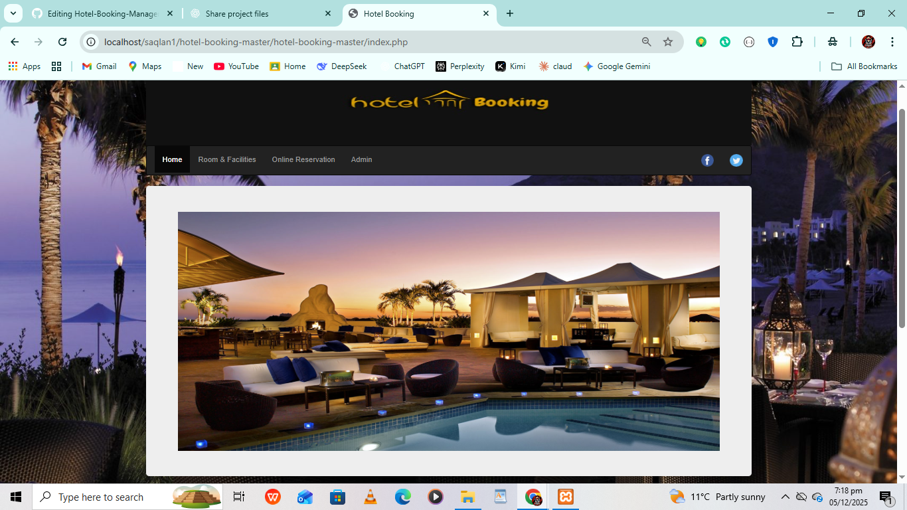
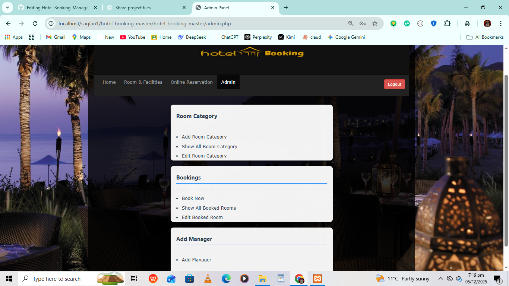

# 🏨 Hotel Booking & Management System


**Online Hotel Booking & Management System** developed using **PHP** for backend and **MySQL** for database.  
This system allows users to book hotel rooms online and enables the admin to manage rooms, facilities, and bookings efficiently.

---

## 📌 Table of Contents
- [Features](#features)
- [Technologies Used](#technologies-used)
- [Installation](#installation)
- [Usage](#usage)
- [Screenshots](#screenshots)
- [Future Enhancements](#future-enhancements)
- [License](#license)
- [Author](#author)

---

## ✨ Features

### User Role
- View room facilities, prices, and availability.
- Book desired rooms online easily.

### Admin Role
- Secure login system for the admin panel.
- Add, delete, and edit room facilities.
- Add, delete, and edit room categories.
- Manage number of rooms (Add, Remove, Edit).
- View booked rooms and booking details.
- Add new admin users with proper authorization.

---

## 🛠️ Technologies Used
- **Backend:** PHP  
- **Database:** MySQL  
- **Frontend:** HTML, CSS, JavaScript (optional)  
- **Server:** Apache / XAMPP / WAMP  

---

## 🚀 Installation

1. Clone the repository:  
   ```bash
   g## 🖼 Screenshots

### HOME  Page


### Admin Dashboard



<p align="center">Made with ❤️ by <strong>Feeroz Khan</strong></p>

<p align="center">
  <a href="https://laravel.com" target="_blank">
    
  </a>
</p>
